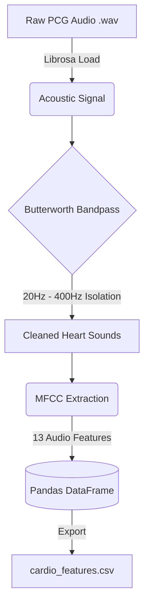

# Cardiovascular Audio Preprocessor

An advanced data engineering pipeline designed specifically for phonocardiogram (PCG) heart sound analysis and multi-modal AI triage models. 

## Architecture & Features



- **Acoustic Filtering:** Applies a 4th-order Butterworth bandpass filter (20Hz - 400Hz) using `scipy.signal`.
- **Feature Extraction:** Utilizes `librosa` to compute Mel-Frequency Cepstral Coefficients (MFCCs).
- **Data Pipeline:** Aggregates statistical variances and means of extracted features, exporting them via `pandas`.

## Usage
Run the pipeline via the command line interface:
```bash
python pipeline.py --input ./data --output cardio_features.csv
```
